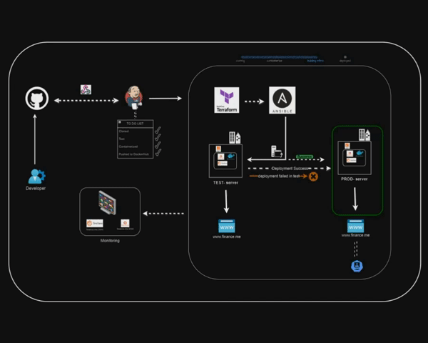

# Project Title

FinanceMe is a Global leading Banking and Financial services provider based out of Germany. The company offers products and
 services like Banking, Funds Management, Loans, Debit Cards and Credits Cards, Investment Banking etc. Initially the company
 was using a Monolithic application architecture, As the company grown, It started facing difficulties in managing the application
 infrastructure and application deployments and Scaling of application when the traffic load increases. FinanceMe has decided to opt
 for microservice architecture for its applications and decided to go DevOps by implementing necessary automations using CICD.
 FinanceMe has decided to use AWS as primary cloud services provider to create servers, databases and application deployments.
 The company’s goal is to deliver the product updates frequently to production automatically with High quality & Reliability. They also
 want to accelerate software delivery speed, quality and reducing feedback time between developers and testers. Currently, they are
 facing following problems, because of various technologies involved in the project.

  you need to implement Continuous Integration & Continuous Deployment using following tools:
 ✓Git- For version control for tracking changes in the code files
 ✓Maven–For Continuous Build
 ✓Jenkins- For continuous integration and continuous deployment
 ✓Docker- For deploying containerized applications
 ✓Ansible- Configuration management tools
 ✓Selenium- For automating tests on the deployed web application
 ✓Terraform- For creation of infrastructure.
 ✓Prometheus and Grafana– For Automated Monitoring and Report Visualization
 This project will be about how to test the services and deploy code to dev/stage/prod etc, just on a click of button.

## Overview

